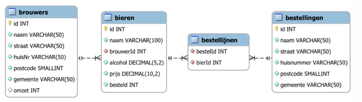
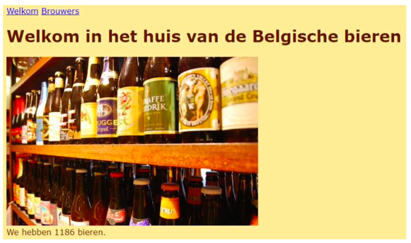
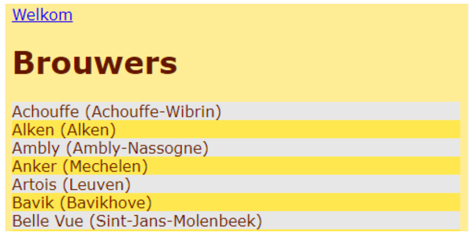
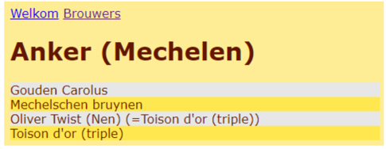
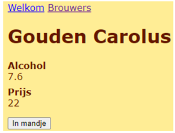
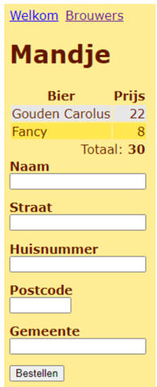
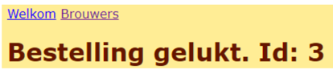

# Opgave

## Algemeen
• Je maakt een webapplicatie voor een biershop.
De klant ziet de beschikbare bieren en kan bieren bestellen.
• Je krijgt de database en afbeeldingen van de instructeur.
• Je krijgt 4 dagen om deze applicatie te maken.
## De database beers

Je applicatie verbindt zicht met deze database met de gebruikersnaam bierke (paswoord bierke).

## Welkompagina

Je leest het aantal bieren uit de database.
Je ziet deze pagina ook als je Welkom kiest.

## Brouwers
Als je Brouwers kiest, toon je een nieuwe pagina.
Die bevat een lijst van alle brouwers, gesorteerd op naam:

Als je een brouwer kiest, toon je een nieuwe pagina.
Die bevat een lijst van alle bieren van die brouwer, gesorteerd op naam:

Als je een bier kiest, toon je een nieuwe pagina.
Die bevat informatie over dat bier.
De gebruiker kan dit bier aan een mandje toevoegen.

Als "in je mandje" je kiest, toon je een nieuwe pagina:

Je onthoudt het mandje met JavaScript in een sessionStorage object in de browser.
Elke pagina bevatten nu een hyperlink Mandje.

Je toont deze pagina ook als de gebruiker Mandje aanklikt.

De pagina toont in de bovenste helft de bieren die de gebruiker in zijn mandje plaatste.
De gebruiker kan een bepaald bier maar één keer in zijn mandje plaatsen.

De gebruiker tikt de tekstvakken in nadat hij zijn winkelwagentje vulde.
Naam, Straat, Huisnummer en Gemeente zijn verplicht in te vullen.
Postcode is verplicht in te vullen met een geheel getal tussen 1000 en 9999.

Als je kiest en de tekstvakken correct zijn,
voeg je de bestelling (met zijn detaillijnen) toe aan de database.
Je verhoogt per besteld bier in de table bieren de kolom besteld met 1.

Je maakt het mandje leeg.
Je toont volgende nieuwe pagina:

